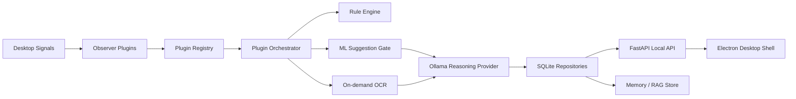

# CognOS

CognOS is a local-first desktop AI assistant for Windows-first activity awareness. It observes approved desktop signals, stores private context locally, and uses deterministic rules plus local LLM reasoning to surface proactive help.

## What Is Implemented

- Plugin-based observer architecture for window tracking, OCR, clipboard, and file-system events.
- Local SQLite repositories for events, screenshots, feature logs, and suggestions.
- Deterministic OCR error detection for stack traces and compiler/runtime failures.
- ML suggestion gate with feature logging and retraining hooks.
- Ollama reasoning provider for local inference.
- FastAPI local service with health, permissions, suggestions, ask, and event-stream endpoints.
- Permission inventory with graceful fallbacks for OS-restricted capabilities.
- Local memory and RAG scaffolding using the existing embedding abstraction.
- Electron desktop shell with live suggestions, ask panel, and permission status.
- Docker service packaging for the API.

## Run The Local Service

```powershell
pip install -e ".[windows,dev]"
ollama pull qwen3:8b
cognos api
```

The API listens on `http://127.0.0.1:8420`.

## Run Capture

```powershell
cognos capture
```

Capture runs in the foreground today. The desktop shell can be started separately and will read suggestions from the local API.

## Run Desktop Shell

```powershell
cd desktop
npm install
npm run dev
```

The desktop shell now starts and supervises the local CognOS API automatically. You can minimize the window; CognOS stays available from the Windows tray and important cards can appear as native Windows notifications.

## Start On Login

```powershell
powershell -ExecutionPolicy Bypass -File scripts\install_startup.ps1
```

Remove startup launch:

```powershell
powershell -ExecutionPolicy Bypass -File scripts\uninstall_startup.ps1
```

## Connectors

CognOS includes local connectors for browser activity and VS Code diagnostics:

- [Browser extension](connectors/browser-extension)
- [VS Code extension](connectors/vscode-extension)

See [connectors/README.md](connectors/README.md) for installation steps.

## Architecture



## Security Model

CognOS does not bypass operating-system protections. Restricted capabilities are disabled until the user grants access or configures an approved integration. Sensitive windows are filtered before storage and before LLM calls.

## Development Checks

```powershell
pytest
python -m cogn_os.api.server
```
